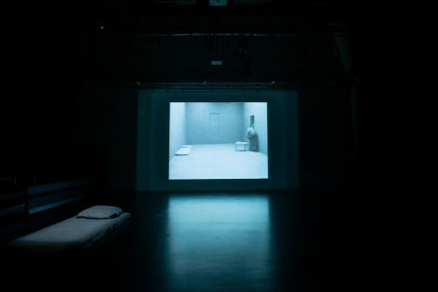
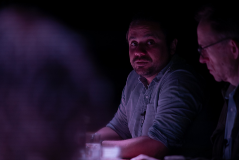
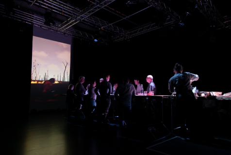
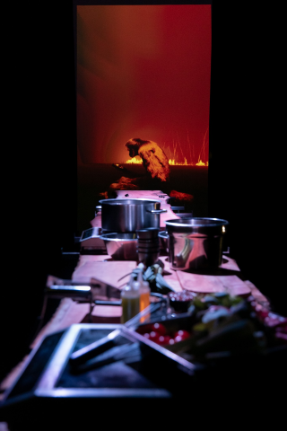

_by Alan Guedes, June 2025_

  
  

  
  

**Title:** "Climate Unreal reminds us of humanity's disconnection from our forests and our children"

It was a truly memorable day at the Minghella Studios at the University of Reading attending the "Climate Unreal" event. The event invited some academics from diverse disciplines, including English Literature, Meteorology, History, Psychology, Business, Agriculture, and myself from Computer Science. The event began with the "Ghost Trio" video presentation by Samuel Beckett and concluded with the immersive "Ghost Feed" video, both encouraging us to draw strong correlations and consider humanity's capacity for disconnection. Beckett's "Ghost Trio" is a minimalist video presentation that set a contemplative tone. The image of the lone man in a dark room, totally focused on a music box, unaware of and detached from the world outside the room. His disconnection from the world is strongly noticeable. Even when visited by a child at his door, he still shows a significant distance and disconnect. This figure became a powerful initial analogy for our collective human condition, highlighting our focus on ourselves, which often blinds us. Following this introspective opening, we transitioned to a cinema room to see "Ghost Feed" during dinner. We were seated around a table with a good meal and engaged in lively discussions. But we felt a strong dichotomy. While we enjoyed a delicious dinner, we also watched the "Ghost Feed" video playing in the background. It is a Virtual Reality-like generated video depicting a monkey completely focused "scrolling" a smartphone while seated in the middle of a burning forest. This scene was profoundly unsettling. The monkey, much like Beckett's isolated man, appeared blind to its surroundings, its focus fixed on the digital screen. The contrast between our comfortable, well-fed discussion and the horrifying reality depicted in the video served as a reminder of the climate crisis we were there to address. In a way, we are also the embodiment of this detachment, which made us uncomfortable and prompted discussion.

From a computer science perspective, my contribution to the panel discussion centered on the dual nature of Artificial Intelligence in the context of climate change. AI presents both immense promise and significant peril. On the one hand, AI offers powerful tools for climate change mitigation research. Machine learning algorithms can analyze vast datasets to predict climate patterns, optimize renewable energy grids, design more efficient materials, and monitor deforestation with unprecedented accuracy. These capabilities can accelerate our understanding and provide innovative solutions to complex environmental challenges. However, I emphasized the darker side of this AI boom: its colossal energy consumption. Training and running large AI models require immense computational power, leading to a substantial carbon footprint. This inherent dichotomy, AI as both savior and burden, highlighted the ethical and practical dilemmas we face in leveraging technology. A recurring theme from other academic discussions was the concept of agency. Many other panelists explored the specific actions and responsibilities each field must take to raise awareness and contribute to climate change solutions. The consensus was clear: no single discipline holds the sole answer, and collective, interdisciplinary agency is essential.

The analogy between Beckett's isolated man and the smartphone-addicted monkey became a central theme of our discussions. Both figures seemed to tragically ignore the escalating crises surrounding them. Particularly for me, the child visiting the man in "Ghost Trio" and the burning forest surrounding the monkey in "Ghost Feed" served as metaphors for future generations and the natural world, respectively. The phrase "our forests are our children" came to my mind and created a strong correlation. It emphasized to me that protecting our forests is also protecting our children, who represent our future. The monkey's blindness to the flames, mirroring the man's indifference to the child, was a reminder to me of humanity's often self-absorbed perspective, our tendency to prioritize immediate gratification or even digital realities over the tangible.

The "Climate Unreal" event concluded with a clear sense of renewed purpose and a positive vision for the future. It underscored the crucial role of academia not just in producing knowledge, but in fostering critical awareness and interdisciplinary collaboration. As academics, our agency lies not only in our individual research but in our collective ability to highlight the "unreal" nature of our current human trajectory and to advocate for a future where humanity's focus shifts from self-absorption to agency. In this future, the health of our "forests" should be recognized as inseparable from the well-being of "our children", which are our future generations. The day ended with a renewed determination that through continued thought, dialogue, and collaborative action, we can indeed contribute to a more sustainable and conscious future.
