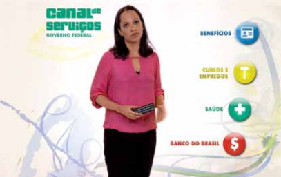
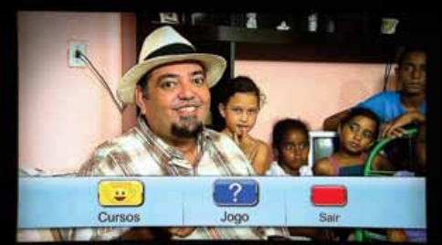

    
    

The Brasil4D was funded by the World Bank and focused on ITU H.761 Ginga for social impact.
This project performed transmission and digital reception of interactive video applications (using Ginga technology) to 100 low-income families.
Those applications presented education and health contents, besides labor opportunities.
The Brazilian Broadcast Community SET awarded Brasil4D as Best interactivity solution.
It also received awards from the La Cumbre TV Abierta and FRIDA Program because its innovative technological solutions and social impact.
We describe this impact in a report from the World Bank.

References:

- [:fontawesome-solid-file: report PDF](http://documents.worldbank.org/curated/en/232621468230956108/pdf/809560WP0PORTU0Box0379824B00PUBLIC0.pdf)
- [:fontawesome-brands-youtube: youtube video](https://www.youtube.com/embed/T5hE0l_NkfY)
