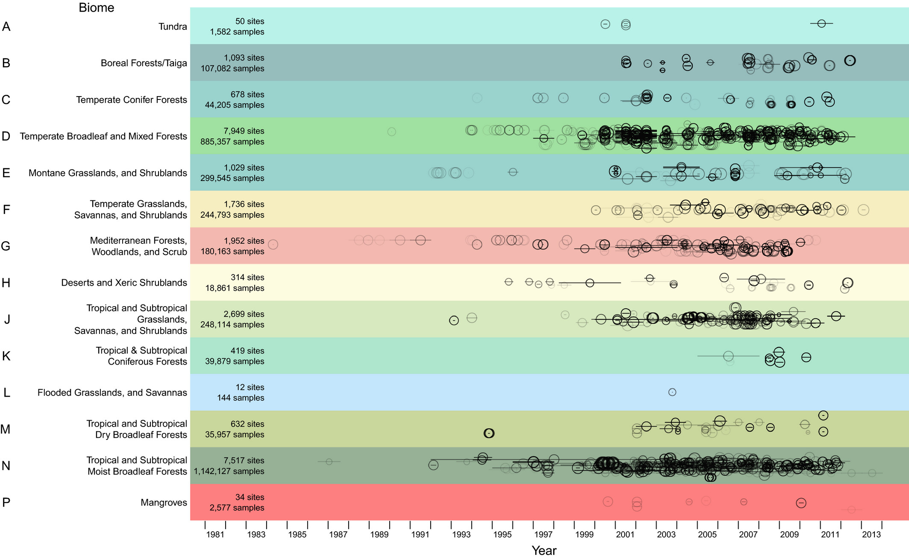

**Project Title:** Next-Generation Prediction of Biodiversity Intactness Index  
**Supervisory Team:** Alan Guedes, [National History Museum's PREDICTS](https://www.nhm.ac.uk/our-science/research/projects/predicts.html)  
**Suitable degree:** PhD  
**Active student:** [Benjamin Parkinson](mailto:benjamin.parkinson@pgr.reading.ac.uk)  

  
  

  

## Project Overview

The escalating impact of human activities on biodiversity, intensified by climate change, and quantifiable by the Biodiversity Intactness Index (BII)[^1], demands new prediction-based methods. Current BII prediction methods primarily stem from an ecological perspective[^2], often lacking the integration of recent advancements in machine learning. While a wealth of multimodal biodiversity data exists, from reports to environmental data (climate and land usage), these valuable sources remain isolated, preventing a holistic understanding of intricate ecological relationships. MM-BioGraph directly addresses BII by integrating into graph-based structures and using existing knowledge bases (e.g. NHM [Planetary Knowledge Base](https://biss.pensoft.net/article/111168)[^5]). This novel approach represents relationships among species and environmental variables, revealing patterns and uncovering hidden connections. This project is a strategic partnership with the Natural History Museum's (NHM) Future Lab, leveraging their expertise on their BII dataset called [PREDICTS](https://www.nhm.ac.uk/our-science/research/projects/predicts/science.html). Central to our methodology is the innovative application of Graph Neural Networks (GNNs)[^3] and Large Language Models (LLMs)[^4]. This approach will not only overcome the limitations of current ecology regression models but also provide graph-based explainability support. We will build predictive models capable of understanding these relationships in the context of BII prediction, identifying previously unknown ecological connections obscured by biodiversity data complexity. Therefore, this project is set to deliver highly impactful new methods for biodiversity conservation.

## Project Goals

The primary goals of this project are to: 1) Establish a comprehensive multimodal biodiversity dataset encompassing knowledge graphs, ecological conservation, and land usage data to ensure robust graph representation, leveraging the PREDICTS dataset[^6], followed by a GNN-based baseline model to identify species interactions and ecosystem dependencies. 2) Advance multimodal modeling with LLMs by developing cutting-edge models that integrate LLMs with visual data, surpassing the GNN baseline to predict complex relationships, delivering more accurate and comprehensive insights.

## References

[^1]: NHM Biodiversity Intactness Index: https://www.nhm.ac.uk/our-science/services/data/biodiversity-intactness-index.html
[^2]: **The database of the PREDICTS (Projecting Responses of Ecological Diversity In Changing Terrestrial Systems) project:** https://onlinelibrary.wiley.com/doi/full/10.1002/ece3.2579
[^3]: **TIVA-KG: A Multimodal Knowledge Graph with Text, Image, Video and Audio:** https://dl.acm.org/doi/abs/10.1145/3581783.3612266
[^4]: **Knowledge Graph Large Language Model (KG-LLM) for Link Prediction:** https://arxiv.org/abs/2403.07311
[^5]: **Planetary Knowledge Base: Semantic Transcription Using Graph Neural Networks:** https://biss.pensoft.net/article/111168
[^6]: PREDICTS Database 2016 Release: https://data.nhm.ac.uk/dataset/the-2016-release-of-the-predicts-database
