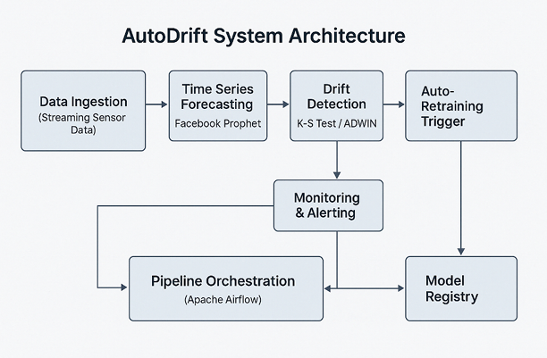

# MLOps Method for LLM Reliability

  

Fig 1: AutoDrift pipeline integrating forecasting, drift detection and automated MLOps orchestration[^1]. {: style="text-align: center"}

## Project Overview

This project focuses on developing an MLOps method to ensure the reliability of Large Language Models (LLMs) in production environments. In this context, reliability is defined as the capability of the model to consistently generate factually accurate, contextually relevant outputs while adapting to evolving real-world data distributions over time. To achieve this, the method will focus on MLOps methodologies to reduce drift and hallucination. The research addresses these critical challenges through a pipeline that encompasses continuous data ingestion, runtime policy enforcement, and active feedback loops. For instance, the method incorporates forecast-aware concept drift detection mechanisms, building upon works like AutoDrift (Fig.1)[^1] to trigger proactive retraining pipelines. Simultaneously, it integrates observability primitives to detect and interpret structural and factual errors, drawing inspiration from targeted hallucination evaluations using datasets like HalluLens[^2]. Ultimately, these theoretical advancements and practical tools aim to secure the compliant and reproducible deployment of foundation models in enterprise domains.

## References

[^1]: **AutoDrift:** https://ieeexplore.ieee.org/document/11129558  
[^2]: **HalluLens:** https://arxiv.org/abs/2504.17550  
