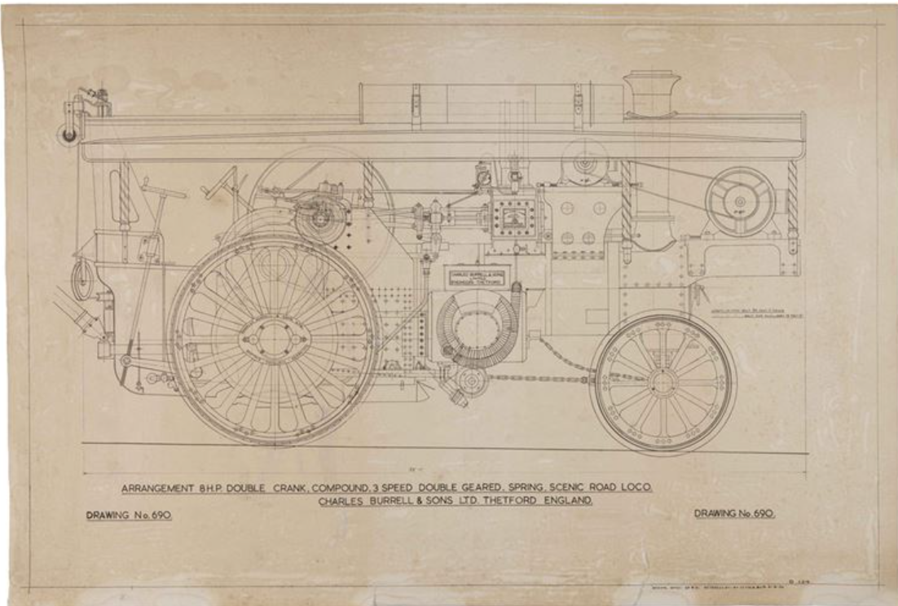
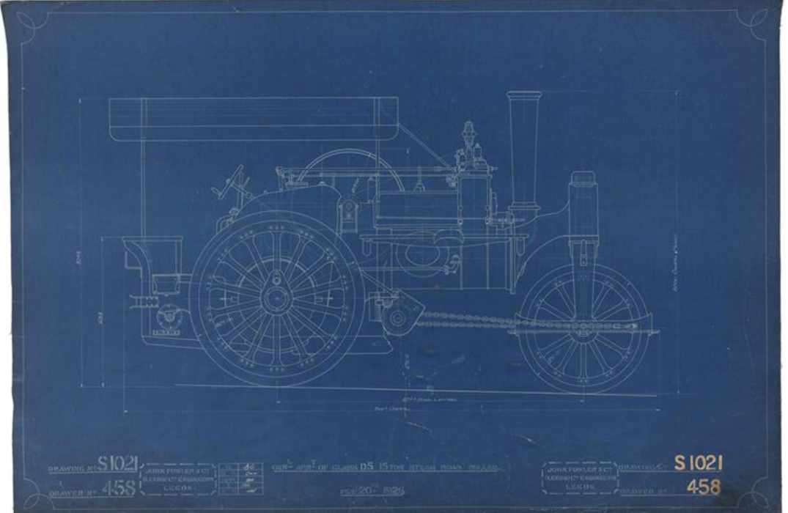

**Supervisory Team:** Alan Guedes, [MERL member](https://merl.reading.ac.uk/)

  
   
  
   
  Fig 1: Samples of rural machinery heritage images. Source [3].

This project investigates the use of Generative AI (GenAI) to create accurate 3D representations of historical rural machinery from engineering drawings containing complex technical specifications, multiple orthographic projections, and handwritten annotations. It addresses a major challenge in heritage research: enabling access to machinery that no longer exists or has significantly deteriorated. By transforming archival 2D technical drawings into structured 3D Computer-Aided Design (CAD) models, the project creates digital surrogates that support research, preservation, and public engagement. Building on the established partnership between Computer Science (CS) and the Museum of English Rural Life (MERL), the project advances original research at the intersection of artificial intelligence and museum scholarship. It targets two complementary technical innovations: (1) a Computer Vision pipeline for automated metadata extraction and feature labelling from digitised heritage drawings, and (2) a domain-specific GenAI model capable of learning the complex 2D-to-3D translation required for technical engineering material. Unlike conventional image-to-3D systems trained on natural images, this approach is tailored to structured historical drawings. The project's impact lies in producing open-source tools, curated datasets, and validated 3D CAD outputs, strengthening interdisciplinary collaboration while delivering a distinctive contribution to digital heritage and AI research.

References:

[1] https://arxiv.org/pdf/2505.14521  
[2] https://arxiv.org/pdf/2110.10863  
[3] https://merl-shop.co.uk/shop/blueprints.html  
