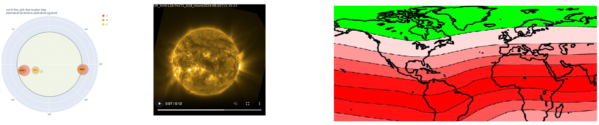

**Supervisory Team:** Alan Guedes, Nachiketa Chakraborty

  

## About

This project develops a geometric deep-learning framework to enable localised geomagnetic forecasting driven by solar activity. Operational space-weather prediction still relies primarily on physics-based geomagnetic models that produce global indices but lack the spatial granularity needed to anticipate regional impacts on critical infrastructure such as power grids, satellites, and communication systems. The project introduces a cross-sphere learning paradigm built on two interconnected spherical graphs: one modelling the Sun’s magnetic surface and another representing Earth’s geomagnetic field. Solar observations—particularly SDO/HMI magnetograms—are projected onto HEALPix-like meshes, while terrestrial geomagnetic measurements form a corresponding spherical graph capturing spatial variability. A harmonised dataset links solar flare activity, coronal mass ejections, solar-wind parameters (e.g., DSCOVR), and geomagnetic indices (Kp, Dst, AE) within a 1–3-day propagation window, integrated via the NOAA Space Weather Portal for reproducibility. Graph Neural Networks and spherical CNNs, enhanced with physics-informed message passing, learn cross-sphere dependencies that characterise how solar magnetic energy propagates through the heliosphere and manifests as localised geomagnetic disturbances, delivering probabilistic location-specific forecasts to strengthen early-warning capabilities and infrastructure resilience.

---

## References

[1] Yan, P., Li, X., Zheng, Y., *et al.* (2024). A real-time solar flare forecasting system with deep learning methods. *Astrophysics and Space Science, 369:110.* https://doi.org/10.1007/s10509-024-04374-8
