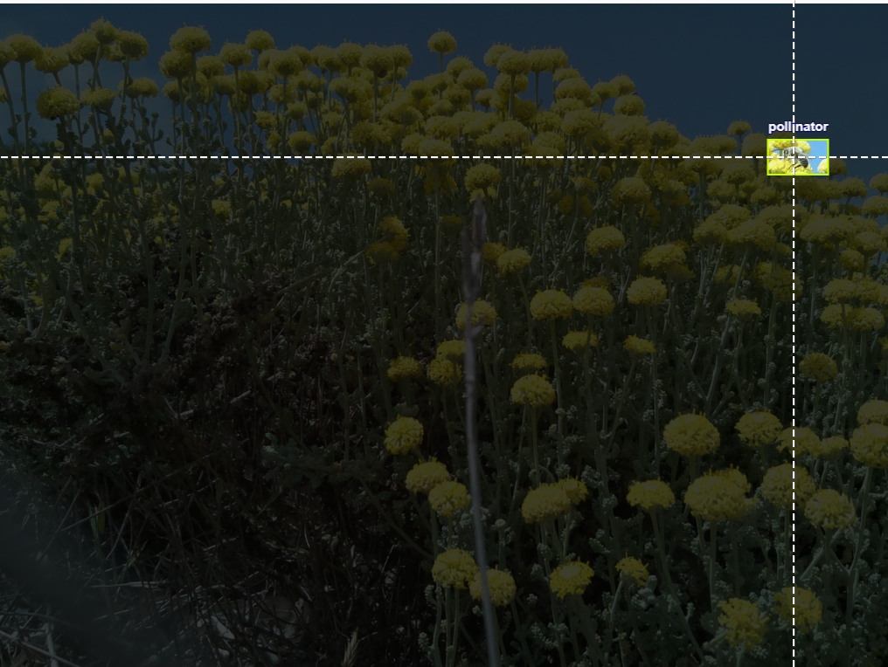
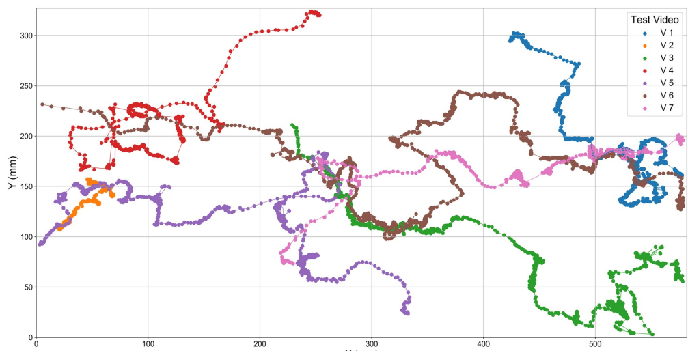

**Project Title:** Computer Vision for Pollination Insects Monitoring (CV-Pollination)  
**Supervisory Team:** Alan Guedes, [Reading Bee team](https://research.reading.ac.uk/bees/)

## About

  
  

  
  

Pollinating insects are crucial for agriculture, but current monitoring methods rely on manual techniques that are expensive, labor-intensive, and impractical for large-scale use. This research uses advanced computer vision and multimodal models to analyze existing datasets, integrating environmental factors such as plant species and seasonal variations. Understanding pollinator behavior is essential in the context of climate change, as shifting conditions impact ecosystems and crop productivity. By developing cost-effective and energy-efficient tools, this project aims to enhance understanding of pollination dynamics, providing valuable insights into the relationships between insects, crops, and the environment. The project will conduct field experiments in collaboration with the University of Reading's Sustainable Land Management Department to validate the developed models.

Our primary goals are to: 1) Developing comprehensive, well-annotated **datasets of insect behavior**, trajectories, and flower interactions, enhanced through data augmentation; 23) designing detection computer vision models with a focus on minimizing computational demands, making them suitable for deployment in energy- and resource-constrained environments; and 3) **group behavioral understanding** analyze both pollinator behavior and land usage, emphasizing trajectory analysis to interaction patterns.  

## References

- https://insectai.eu/
- https://research.reading.ac.uk/bees/
- https://www.reading.ac.uk/research/impact/highlights/saving-britains-pollinators
- https://journals.plos.org/plosone/article?id=10.1371/journal.pone.0239504

Datasets:

- https://universe.roboflow.com/georgia-institute-of-technology-bqtzy/pollinators
- https://www.kaggle.com/datasets/birdy654/bee-detection-in-the-wild
