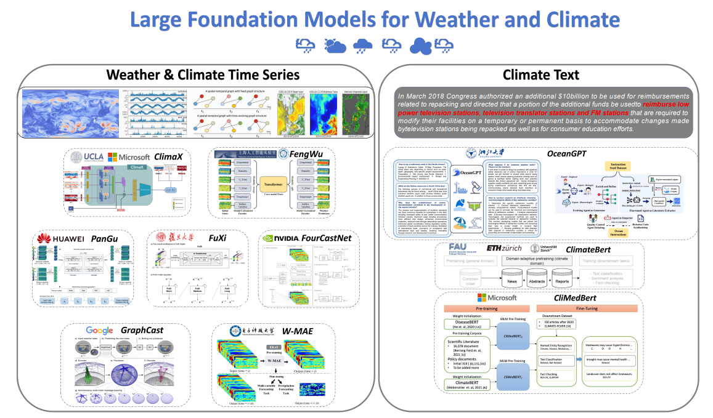
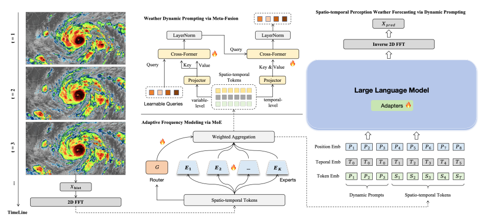

**Project Title:** LLM-Forecast-Ensemble: LLM as a Component for Ensemble Forecast  
**Supervisory Team:** Alan Guedes, [MET Office member](https://www.metoffice.gov.uk/)

## About

  
   
  Fig 1: An overview of large foundation models for weather and climate [1].
  
   
  Fig 2: ClimateLLM for weather forecast [1].

 
 

SS
Atmospheric data assimilation (DA) plays a critical role in improving the accuracy of numerical weather prediction (NWP) by integrating observational data with physical models. Ensemble-based DA methods, such as the Ensemble Kalman Filter (EnKF) and Particle Filters (PF), are widely used to handle uncertainties. However, these traditional methods face limitations in managing highly nonlinear and non-Gaussian error distributions, particularly in complex atmospheric dynamics like extreme weather events. Recent advancements in Machine Learning [1], particularly large language models (LLMs), present an opportunity to enhance these forecasting methods. LLMs, which have demonstrated a remarkable ability to capture intricate patterns and relationships in data, can be adapted to atmospheric forecasting (e.g., ClimateLLM[2]). The novelty of this approach lies in using LLMs not only to process historical weather data but also to integrate contextual information from meteorological reports, localized text data, and computer vision analysis of satellite imagery. While prior work has explored integrating LLM into ensemble methods, this project will focus on employing LLMs as ensemble components for forecasting by leveraging contextual text and satellite imagery. The aim is to develop a robust method that enhances forecast accuracy by combining physical models with data-driven insights from LLMs.

## References

[1] https://arxiv.org/pdf/2312.03014  
[2] https://arxiv.org/pdf/2502.11059  
