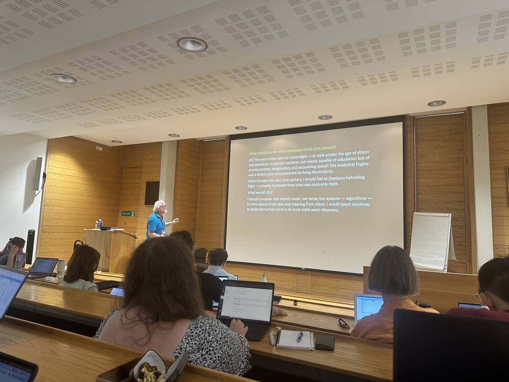

_by Alan Guedes, July 2026_

  

Attending the [Digital Humanities Oxford Summer School (DHOXSS)](https://digital.humanities.ox.ac.uk/digital-humanities-oxford-summer-school) 2026 at the University of Oxford was an inspiring and enriching experience. As someone coming from a Computer Science, participating gave me fresh perspectives on how computational methods are reshaping humanities scholarship. The 2026 edition featured 6 tracks:

- [From Text to Tech](https://engsci.msgfocus.com/c/113jAjgrMFaRS6ypVWKFAvESUcSN1): Practical Python  techniques to transform textual sources into computable formats, natural language processing pipelines, and text analysis.
- [Applied Data Analysis](https://engsci.msgfocus.com/c/113jAjhPqApWJB6dz0nmDjphtsAWk): Practical Python techniques for structuring, querying, and extracting insights from text.
- [An Introduction to Text Encoding Initiative (TEI)](https://engsci.msgfocus.com/c/113jAjjd4vF1B5E1c403G79G2Ij5D): Core principles and hands-on practices for standardizing, annotating, and preserving digital textual corpora using TEI.
- [An Introduction to Digital Humanities](https://engsci.msgfocus.com/c/113jAjkAIqU6sAbOP7CKIUU4BY1eW): A overview of concepts, methodologies, and cross-disciplinary paradigms.
- [An Introduction to Humanities Data](https://engsci.msgfocus.com/c/113jAjlYmm9bk4JCsbfrLIEtbdJof): Managing, modeling, and curating heterogeneous data types unique to humanities inquiries.
- [Using AI Tools and Technologies in Research Libraries](https://engsci.msgfocus.com/c/113jAjnm0hogbzhq5eS8OwoRKtrxy): Examining the deployment of machine learning, computer vision, and generative AI in GLAM (Galleries, Libraries, Archives, and Museums) environments.

During the week, I had the opportunity to explore a bit of everything across the diverse programme. What struck me most was seeing firsthand how researchers in the humanities are adopting software engineering methodologies, data pipelines, and modern AI techniques to interrogate historical archives, literature, cultural heritage collections, and library repositories. The depth of domain knowledge combined with computational rigor was truly impressive.
