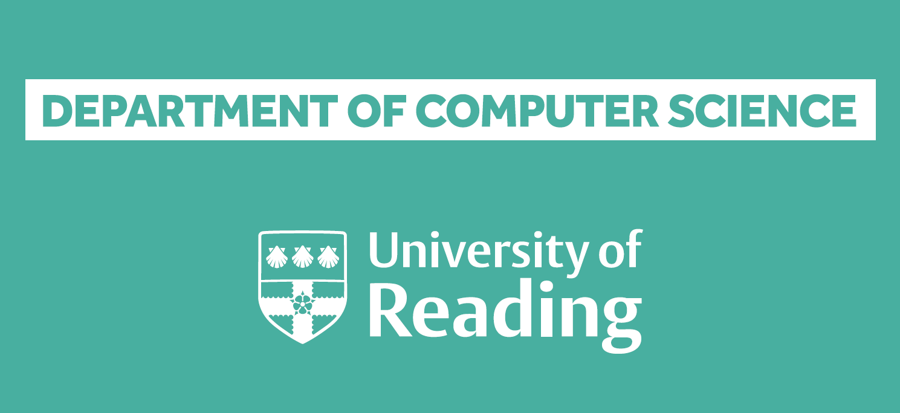
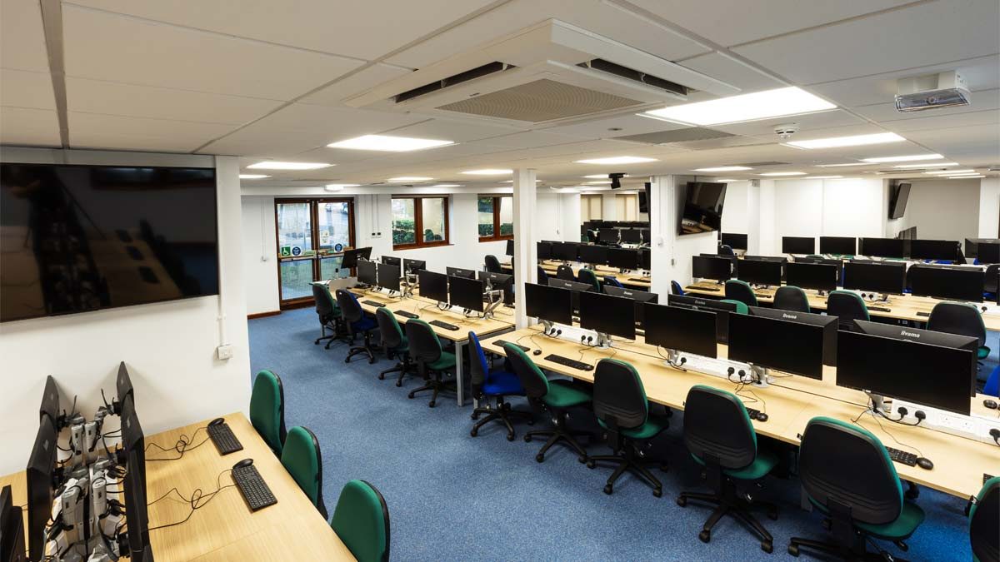

_by Alan Guedes, September 2026_

  
  

As September arrives, another academic year begins at the University of Reading. Welcoming new and returning students to campus is always an exciting moment, marking a fresh cycle of learning, programming projects, and research exploration in the Department of Computer Science.

This academic year, I will continue teaching across both undergraduate and postgraduate programmes to three core modules:

- [**CS1IP: Imperative Programming**](https://www.reading.ac.uk/modules/documents?acyear=2025%252f6&modcode=CS1IP&schoolcode=MPS%20CS%7CMPS%20MATHST%7CMPS%20MET): Our foundational module for first-year undergraduates (Part 1). It introduces core imperative programming principles, structured problem-solving, algorithm design, and version control with Git.

- [**CS2PP: Programming in Python**](https://www.reading.ac.uk/modules/documents?acyear=2025%252f6&modcode=CS2PP&schoolcode=MPS%20CS%7CMPS%20MATHST%7CMPS%20MET): An intermediate module for second-year undergraduates (Part 2). It builds proficiency in Python, covering data manipulation, scientific scripting, and practical visual programming with PyQt.

- [**CSMASC: AI Software on the Cloud**](https://www.reading.ac.uk/modules/documents?acyear=2025%252f6&modcode=CSMASC&schoolcode=MPS%20CS%7CMPS%20MATHST%7CMPS%20MET): A postgraduate MSc module exploring the development of AI-powered applications for Business application in modern cloud environments. We address no-code machine learning pipelines, cloud services, and Multi-agent systems.
