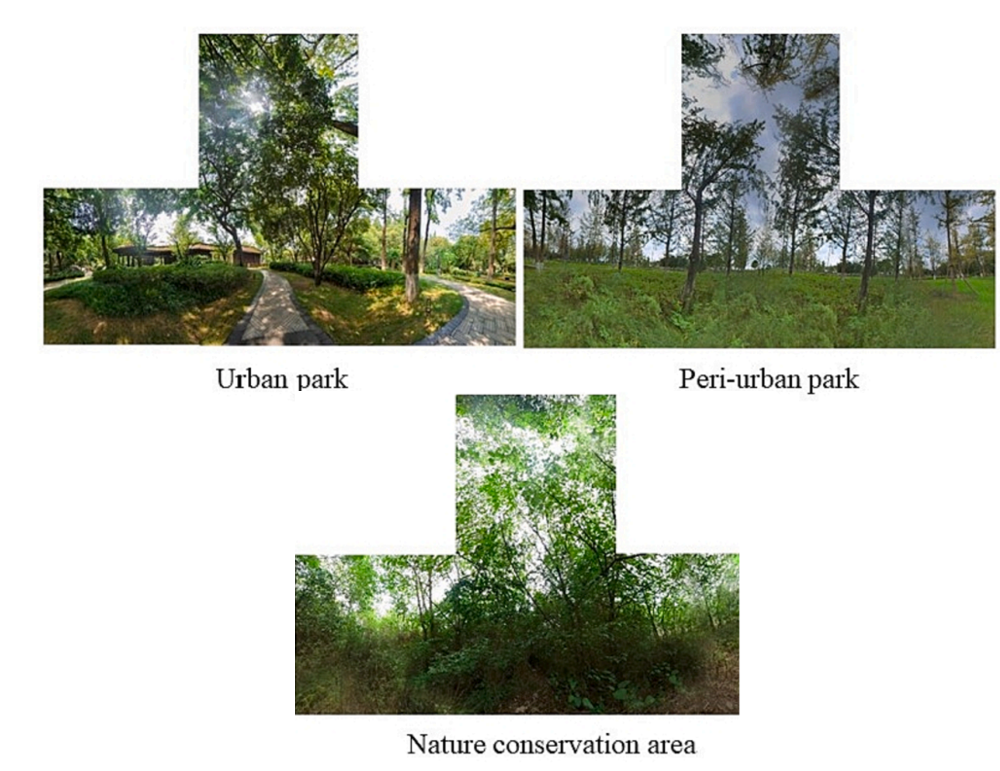

# Computer Vision Analysis of Biodiversity-related 360-degree Images

  

360-degree imagery enables immersive capture of natural environments but poses challenges for automated ecological analysis due to distortion and wide field-of-view. This project will develop computer vision methods to analyse biodiversity elements visible within 360-degree images, focusing on visual cues that relate to high-biodiversity environments. This includes analysing visual spectrum properties (e.g., amount and distribution of green vegetation) as well as semantic elements (e.g., number of plants, trees, and habitat structures). The work will involve spherical image preprocessing, segmentation or detection modelling, and aggregation of ecological indicators. Example datasets are available via the Synthesis of Systematic Resources (SYN): https://syns.soton.ac.uk/
