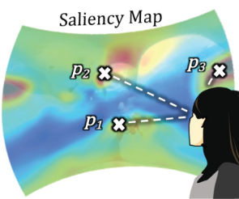

# Prediction and Visualisation of User behaviour in 360-degree Video

  

Understanding how users explore 360-degree video is essential for immersive media delivery and experience design. This project aims to develop models to predict user viewing behaviour based on head-movement and viewport datasets. In addition, interactive visualisation tools will be created to display attention heatmaps and scanpaths. The work will support research in VR analytics, adaptive streaming, and immersive storytelling. Example dataset is available at: https://gitlab.com/miguelfromeror/head-motion-prediction
