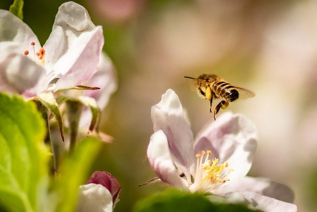

**Project Title:** CV for Pollination Insects Monitoring  
**Supervisory Team:** James Ferryman, Deepa Senapathi (Reading Bee team[^1])  
**Suitable degree:** PhD  
**Active student:** Benjamin Aitken  

  
  

## Project Overview

Pollinating insects are crucial for agriculture, but current monitoring methods rely on manual techniques that are expensive, labour-intensive, and impractical for large-scale use[^2]. This research uses advanced computer vision and multimodal models to analyse existing datasets[^3][^4], integrating environmental factors such as plant species and seasonal variations. Understanding pollinator behaviour is essential in the context of climate change, as shifting conditions impact ecosystems and crop productivity[^5]. By developing cost-effective and energy-efficient tools, this project aims to enhance understanding of pollination dynamics, providing valuable insights into the relationships between insects, crops, and the environment[^6]. The project will conduct field experiments in collaboration with the University of Reading's Sustainable Land Management Department to validate the developed models.

## Project Goals

The primary goals of this project are to: 1) develop comprehensive, well-annotated **datasets of insect behaviour**, trajectories, and flower interactions, enhanced through data augmentation; 2) design detection computer vision models with a focus on minimizing computational demands, making them suitable for deployment in energy- and resource-constrained environments; and 3) **analyse group behavioural understanding** to examine both pollinator behaviour and land usage, emphasizing trajectory analysis and interaction patterns.  

## References

[^1]: Reading Bee team: https://research.reading.ac.uk/bees/
[^2]: **Tracking individual honeybees among wildflower clusters with computer vision-facilitated pollinator monitoring:** https://journals.plos.org/plosone/article?id=10.1371/journal.pone.0239504
[^3]: Roboflow Pollinators Dataset: https://universe.roboflow.com/georgia-institute-of-technology-bqtzy/pollinators
[^4]: Bee Detection in the Wild Dataset: https://www.kaggle.com/datasets/birdy654/bee-detection-in-the-wild
[^5]: Saving Britain's Pollinators: https://www.reading.ac.uk/research/impact/highlights/saving-britains-pollinators
[^6]: InsectAI: https://insectai.eu/
