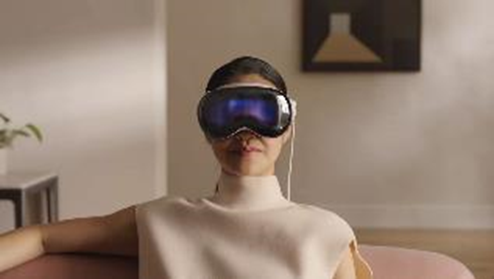
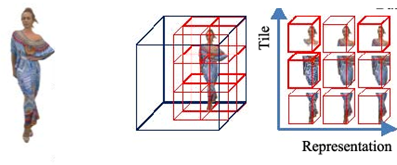

# Volumetric Video User Prediction

**Supervisory Team:** Alan Guedes

  
  
   
  <b>Apple Vision Pro and VV Tile-Based Streaming.</b>

## Project Overview

With the recent popularisation of volumetric content driven by headsets like the Apple Vision Pro, volumetric video offers a continuous volumetric representation of objects, making it particularly useful for remote presence in VR/XR environments. In this format, the user has viewport limited by head movements. Predicting the users’ head movements and displayed viewports are essential to improve its delivery. Machine Learning models, particularly new transformer methods, can leverage both user historical positions and video information, such as video saliency, for such predictions[^1]. The project aims to develop both a model method and a visualisation for this prediction using existing dataset from the work "Understanding User behaviour in Volumetric Video Watching: Dataset, Analysis and Prediction"[^2].

## References

[^1]: **Viewport Prediction for Volumetric Video Streaming by Exploring Video Saliency and Trajectory Information:** https://ieeexplore.ieee.org/document/11030738
[^2]: **Understanding User behaviour in Volumetric Video Watching:** https://arxiv.org/abs/2308.07578
